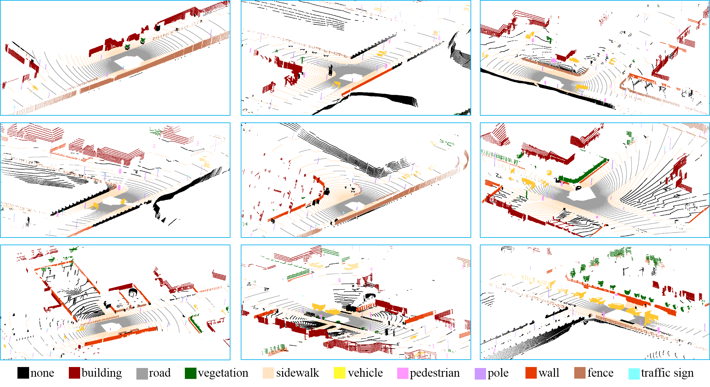

Annotated LiDAR Point Clouds Extraction From CARLA Simulator
===============

This modified version of CARLA simulator provides an open-source method to 
extract LiDAR point clouds with point-level ground truth labels for semantic 
segmentation. The modified lidar sensor inherits the highly configurable 
parameters, such as sensor location, vertical/horizontal field of view, 
vertical/horizontal resolutions and rotation frequency. So, this method can 
be used to simulate various real devices and settings, including vertically 
side-faced 2D lasers used in [Oakland dataset][Oaklandlink], 3D real-time 
sensors like Velodyne HDL-64 used in [KITTI dataset][KITTIlink], and 3D 
static laser scanners used in [Semantic3D.net dataset][Semantic3Dlink]. 

[Oaklandlink]: http://www.cs.cmu.edu/~vmr/datasets/oakland_3d/cvpr09/doc/
[KITTIlink]: http://www.cvlibs.net/datasets/kitti/index.php
[Semantic3Dlink]: http://semantic3d.net/

We provide Python APIs to automatically extract annotated point clouds. A 
demo is provide in . 
Users can specify sensor parameters, environment parameter like number of 
vehicles and pedestrians, and maximum frames of the simulated data. The 
labels are: 0-None, 1-Buildings, 2-Fences, 3-Other, 4-Pedestrians, 5-Poles, 
6-RoadLines, 7-Roads, 8-Sidewalks, 9-Vegetation, 10-Vehicles, 11-Walls, 
12-TrafficSigns. Examples of the simulated point clouds are shown as follows:

Usage
----

Clone or download the project from our
[GitHub repository](https://github.com/wangfei-824/carla)

    $ git clone https://github.com/wangfei-824/carla.git

Switch to the `lidar_annotation` branch and build it following the 
instructions at . 
Then launch the editor and package the project to the default directory.

Start the server:

    $ cd ~/carla/Unreal/CarlaUE4/LinuxNoEditor
    $ ./CarlaUE4.sh Town01 -windowed -ResX=1024 -ResY=768 -benchmark -fps=10 -carla-server

Open a new terminal and start data collection:

    $ cd ~/carla/PythonClient
    $ python data_collection.py

License
-------

CARLA specific code is distributed under MIT License.

CARLA specific assets are distributed under CC-BY License.

Note that UE4 itself follows its own license terms.
